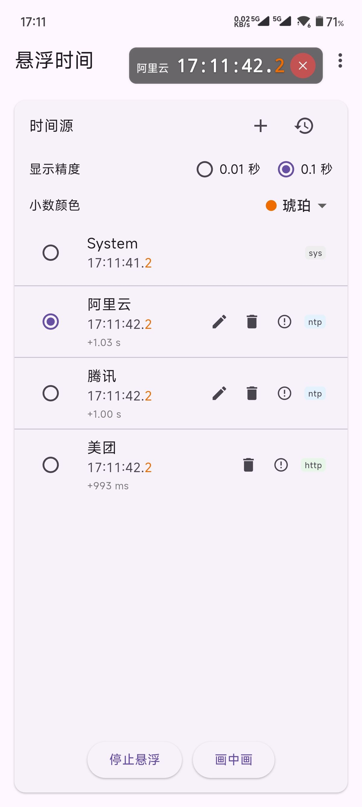
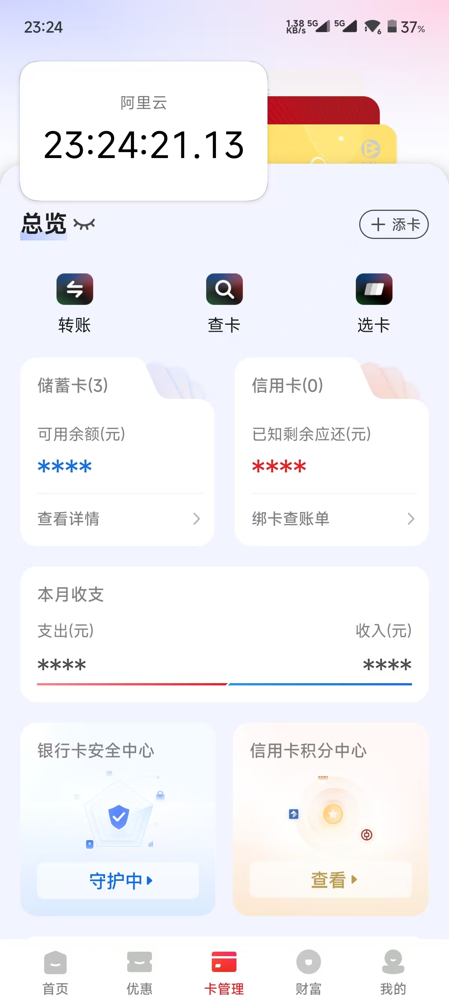

    <h1>悬浮时间</h1>

  
  
 

 

一个使用 Flutter 编写的轻量级应用，在 Android 上可将一个可拖动的时钟以悬浮窗形式显示在屏幕任意位置，支持多源时间同步与偏差显示。

**主要特性**

- 精确显示到百分秒（centisecond，例如 `12:34:56.78`）。
- 可在 Android 上以悬浮窗（Overlay）形式显示，可拖动、固定与关闭。
- 支持多时间源（System、NTP、HTTP 等），并展示与系统时间的偏差（ms）。
- 定期自动同步 NTP/HTTP 时间并保存最近同步记录。
- 支持本地持久化用户添加的时间源（`shared_preferences`）。
- 支持画中画模式（PiP）。
